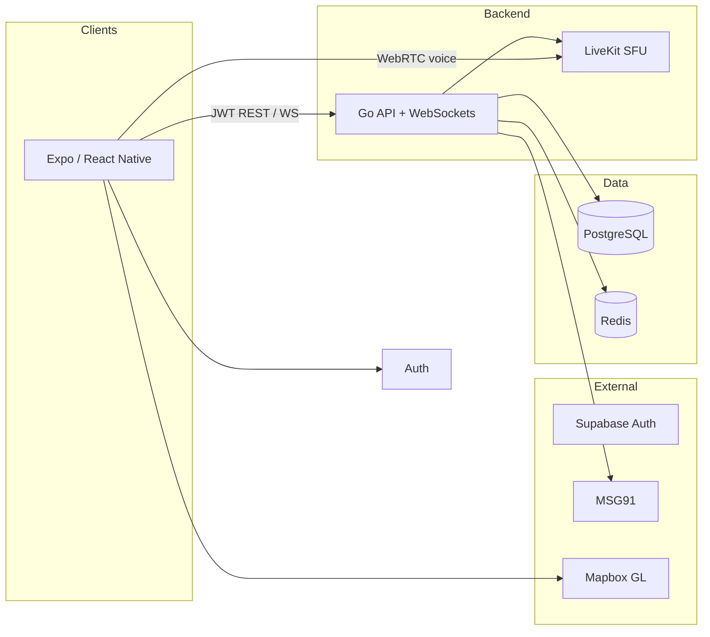

# Pacenote

**The real-time convoy companion for car people.**

Pacenote replaces the usual patchwork of WhatsApp voice calls and shared Google Maps links with one purpose-built app: **voice**, **live convoy tracking**, **safety alerts**, and **shareable route cards** — built for drives where staying together actually matters.

The name comes from rally co-driving: the co-driver reads *pacenotes* to the driver in real time — voice, trust, and navigation in sync. Pacenote does the same thing for an entire convoy.

> **V1 focus:** Private convoy sessions · Built for the VAG (Volkswagen Audi Group) community in India · Hundreds of concurrent users

---

## Features

| | |
|---|---|
| **Convoy sessions** | Host creates a private room with a short invite code (`ECR-42`). Members request to join; the host approves before anyone gets on the map or voice channel. |
| **Live voice** | WebRTC via self-hosted [LiveKit](https://livekit.io/) — low-latency convoy comms without juggling phone calls. |
| **GPS tracking** | ~2s location updates over WebSocket. See where everyone is, convoy order, and gap alerts — computed on-device, fanned out through Redis. |
| **Safety layer** | In-session pings (SOS, RTA, cops, low visibility) plus on-device crash detection with a 60s “I’m safe” window before emergency contacts are notified via WhatsApp/SMS. |
| **Route cards** | GPS buffered on-device during the drive; bulk upload at session end. Share a beautiful route summary image natively — no server-side image generation. |

### Alert types (in-session)

| Alert | Default radius |
|-------|----------------|
| SOS | 50 m |
| Road traffic accident | 40 m |
| Cops | 30 m |
| Low visibility | 30 m |

---

## Architecture



**Design principles**

- **Contract-first:** Protobuf definitions in `packages/contracts` — Go and TypeScript codegen from the same `.proto` files. No hand-duplicated message shapes.
- **Ephemeral location:** Live GPS lives in Redis (10s TTL). PostgreSQL is the source of truth for sessions, alerts, routes, and crash audit logs.
- **Safety on the edge:** Crash *detection* runs on-device (`expo-sensors`); the server only acts on an explicit SOS after the countdown.

---

## Tech stack

| Layer | Technology |
|-------|------------|
| Mobile | React Native, Expo, Zustand, Mapbox GL |
| API & real-time | Go, WebSockets, Redis pub/sub |
| Voice | LiveKit (self-hosted) |
| Auth | Supabase Auth (Google OAuth + email/password) |
| Database | PostgreSQL |
| Cache / ephemeral | Redis |
| Push | Expo Push |
| Emergency alerts | MSG91 (WhatsApp + SMS) |
| Contracts | Protobuf + [buf](https://buf.build/) |
| Monorepo | pnpm workspaces |
| Local infra | Podman + Compose (`infra/docker`) |

---

## Repository layout

```
pacenote/
├── apps/
│   ├── mobile/          # React Native + Expo
│   └── server/          # Go API, WebSockets, LiveKit integration
├── packages/
│   └── contracts/       # Shared Protobuf schemas (the spine)
├── infra/
│   └── docker/          # Local dev: PostgreSQL, Redis, LiveKit
├── .github/workflows/   # Path-based CI (mobile / server / contracts)
├── package.json
└── pnpm-workspace.yaml
```

**Codegen flow**

```
packages/contracts/proto/*.proto
        │
        ▼  buf generate
apps/mobile/src/generated/   ← TypeScript
apps/server/generated/       ← Go
```

> **Rule:** If a message shape exists in `.proto`, it does not exist as a hand-written duplicate elsewhere.

---

## Getting started

### Prerequisites

- [Node.js](https://nodejs.org/) (LTS)
- [pnpm](https://pnpm.io/)
- [Go](https://go.dev/) 1.22+
- [Podman](https://podman.io/) + [podman-compose](https://github.com/containers/podman-compose) (local services)
- [buf](https://buf.build/docs/installation) (Protobuf codegen, when `packages/contracts` is added)

### Install dependencies

```bash
pnpm install
```

### Start local infrastructure

PostgreSQL, Redis, and LiveKit for development:

```bash
pnpm docker:up
# equivalent: cd infra/docker && podman-compose up -d
```

> Docs and scripts may say `docker compose`; locally we use **Podman** — same Compose file, different runtime.

### Run apps

Once `apps/mobile` and `apps/server` are scaffolded:

```bash
# Mobile (requires dev build — Expo Go is not supported; see EDL in PRD)
cd apps/mobile && pnpm start

# API server
cd apps/server && go run ./cmd/api
```

### Root scripts

| Command | Description |
|---------|-------------|
| `pnpm build` | Build all workspace packages |
| `pnpm lint` | Lint all workspace packages |
| `pnpm test` | Test all workspace packages |
| `pnpm docker:up` | Start Podman Compose stack |

---

## Roles

| Role | Description |
|------|-------------|
| **Convoy host** | Creates the session, approves join requests, can end the convoy |
| **Convoy member** | Joins via invite code, shares location and voice after approval |
| **Emergency contact** | Off-app contact who receives crash/SOS notifications (WhatsApp/SMS) |

---

## Roadmap (V1)

| Milestone | Scope |
|-----------|--------|
| **M1** Foundation | Monorepo, Protobuf pipeline, local dev, auth & profiles |
| **M2** Sessions | Session CRUD, invite codes, join flow, LiveKit rooms |
| **M3** Real-time | WebSocket location, Redis fan-out, map & convoy position |
| **M4** Voice | LiveKit tokens, PTT / open-mic UX |
| **M5** Safety | Alert pings, crash detection, emergency notifications |
| **M6** Route summary | Device buffering, bulk upload, shareable route cards |
| **M7–M8** Launch | Polish, beta with VAG community, store submission |

**Out of scope for V1:** public rooms, music sync, CarPlay/Android Auto, web dashboard, route replay animation.

---

## Performance targets

| Metric | Target |
|--------|--------|
| Location fan-out | < 500 ms end-to-end |
| Voice latency (LiveKit) | < 150 ms |
| API p95 | < 200 ms |
| WebSocket connect | < 1 s |
| GPS update interval | ~2 s |

---

## Contributing

This repo is in early setup. When adding features:

1. Update Protobuf in `packages/contracts` first when the API contract changes.
2. Run codegen before touching Go or mobile handlers.
3. Keep live location ephemeral (Redis only during sessions).
4. Never issue LiveKit tokens from the client — server only.

---

## Name & inspiration

In rally, a **pacenote** is the shorthand the co-driver calls out so the driver knows what’s next — crest, hairpin, jump. Pacenote is that voice for everyone in the convoy: where you are, what’s ahead, and whether someone needs help.

Built for people who drive together — starting with the VAG scene in India.

---

*Product requirements: PRD v1.1 · Engineering decisions logged in the PRD (EDL-01–05)*
