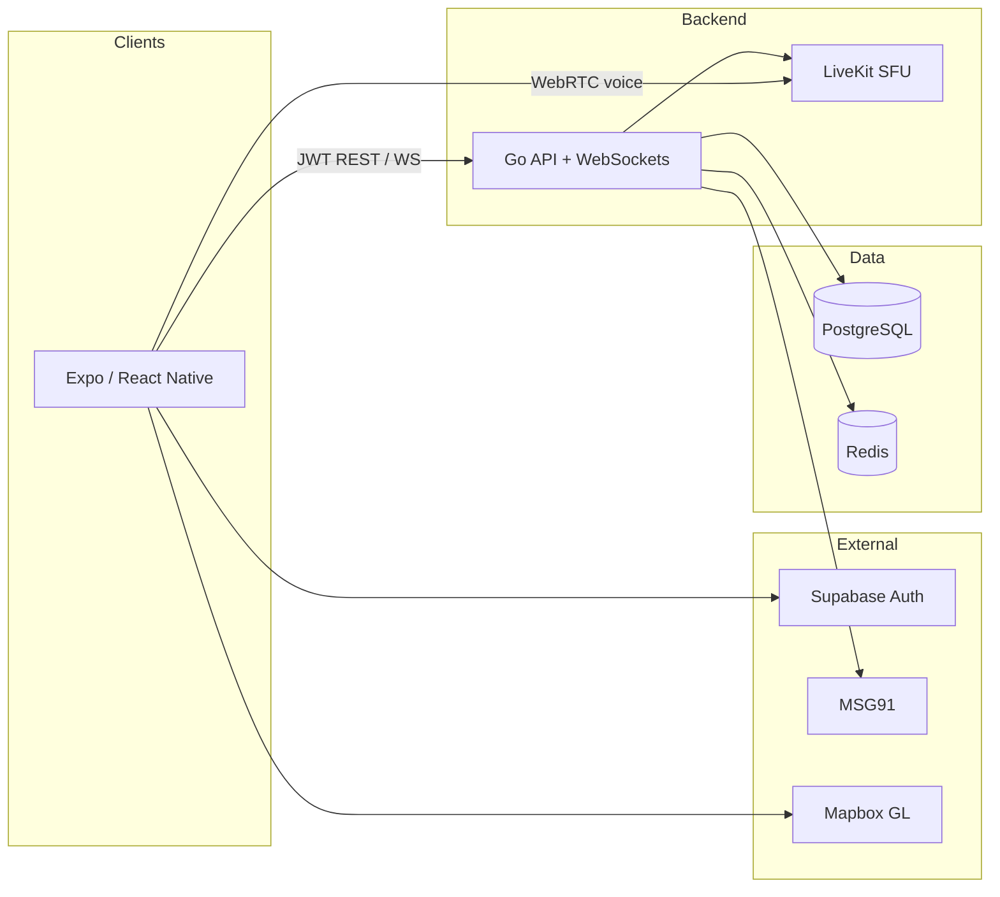

# Pacenote

**Real-time convoy companion for drivers.**

Pacenote combines voice communication, live GPS convoy tracking, in-drive safety alerts, and post-drive route summaries in a single mobile experience—replacing fragmented voice calls and shared map links during group drives.

---

## Features

- **Private convoy sessions** — Host-created rooms with invite codes; join requests require host approval before map or voice access.
- **Live voice** — WebRTC via self-hosted [LiveKit](https://livekit.io/).
- **Convoy tracking** — Periodic location updates over WebSocket with on-device distance and gap logic; server-side fan-out via Redis.
- **Safety alerts** — In-session alerts (SOS, incidents, hazards) with map visualization; on-device crash detection with emergency contact notification.
- **Route summaries** — Device-buffered GPS with bulk upload at session end; client-generated shareable route cards.

---

## Architecture



- **Contract-first API** — Shared Protobuf schemas in `packages/contracts`; Go and TypeScript generated from the same definitions.
- **Ephemeral location** — Live positions in Redis during active sessions; durable session, alert, and route data in PostgreSQL.
- **Edge-assisted safety** — Crash sensing on device; server handles explicit SOS and notification workflows.

---

## Tech stack

| Layer | Technology |
|-------|------------|
| Mobile | React Native, Expo, Zustand, Mapbox GL |
| API & real-time | Go, WebSockets, Redis pub/sub |
| Voice | LiveKit (self-hosted) |
| Auth | Supabase Auth |
| Database | PostgreSQL |
| Cache | Redis |
| Push | Expo Push |
| Emergency alerts | MSG91 |
| Contracts | Protobuf, [buf](https://buf.build/) |
| Monorepo | pnpm workspaces |
| Local infra | Podman, Compose (`infra/docker`) |

---

## Repository layout

```
pacenote/
├── apps/
│   ├── mobile/          # React Native + Expo
│   └── server/          # Go API and WebSocket server
├── packages/
│   └── contracts/       # Shared Protobuf schemas
├── infra/
│   └── docker/          # Local PostgreSQL, Redis, LiveKit
├── package.json
└── pnpm-workspace.yaml
```

Protobuf codegen (when `packages/contracts` is present):

```
packages/contracts/proto/*.proto  →  buf generate  →  apps/mobile, apps/server
```

---

## Getting started

### Prerequisites

- [Node.js](https://nodejs.org/) (LTS)
- [pnpm](https://pnpm.io/)
- [Go](https://go.dev/) 1.22+
- [Podman](https://podman.io/) and [podman-compose](https://github.com/containers/podman-compose)
- [buf](https://buf.build/docs/installation) (for contract codegen)

### Install

```bash
pnpm install
```

### Local infrastructure

```bash
pnpm docker:up
```

This starts PostgreSQL, Redis, and LiveKit via Compose under `infra/docker`. The project uses Podman locally; Compose file format is compatible with Docker.

### Applications

```bash
# Mobile (development build required for native modules)
cd apps/mobile && pnpm start

# API server
cd apps/server && go run ./cmd/api
```

### Root scripts

| Command | Description |
|---------|-------------|
| `pnpm build` | Build all workspace packages |
| `pnpm lint` | Lint all workspace packages |
| `pnpm test` | Run tests across the workspace |
| `pnpm docker:up` | Start the local Compose stack |

---

## Contributing

1. Change Protobuf contracts in `packages/contracts` before updating Go or mobile consumers.
2. Regenerate code after contract changes.
3. Keep live location ephemeral during sessions (Redis only).
4. Issue LiveKit tokens from the server only.

---

## Licence

This project is licensed under the
[Elastic License 2.0](./LICENSE).

You may view, fork, and self-host this code.
You may not offer it as a managed service or build
a competing commercial product from it.

© 2026 Vignesh Manikandan. All rights reserved.
